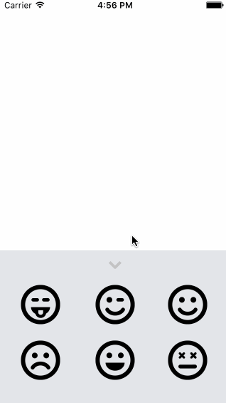

## Canvas Lab Exercise

Time spent: `3`

### Features

#### Required

All required features are implemented

#### Optional

All optional features are implemented

#### The following **additional** features are implemented:

- Faces on canvas temporarily enlarge when panned and maintain other transformations 

Please list two areas of the assignment you'd like to **discuss further with your peers** during the next class (examples include better ways to implement something, how to extend your app in certain ways, etc):

1. My solution for snapping the faces back to their original positions in the drawer may be overcomplicated (I extended UIView to hold each face's original position). Is there a simpler approach?
2. Is there an easy way to get the current rotation and scale of a view? 

### Video Walkthrough 

Here's a walkthrough of implemented user stories:

GIF created with [LiceCap](http://www.cockos.com/licecap/).

## Notes

Describe any challenges encountered while building the app.

* followed this to extend UIVIew: https://medium.com/@ttikitu/swift-extensions-can-add-stored-properties-92db66bce6cd#.49kf15dd1
